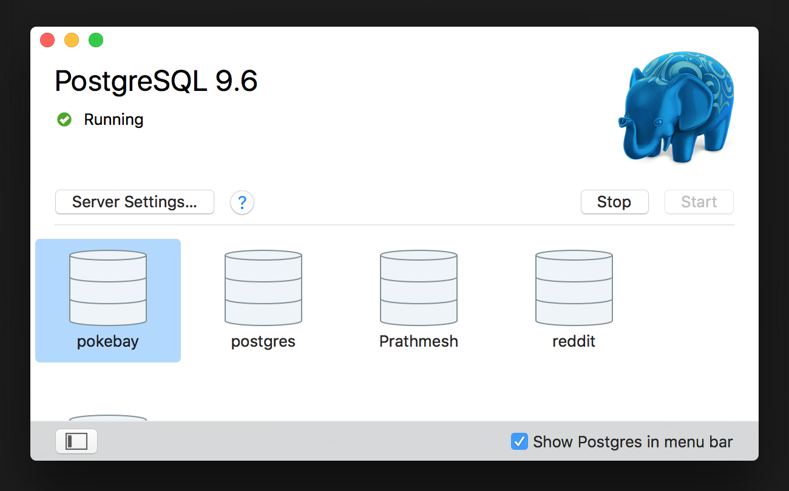
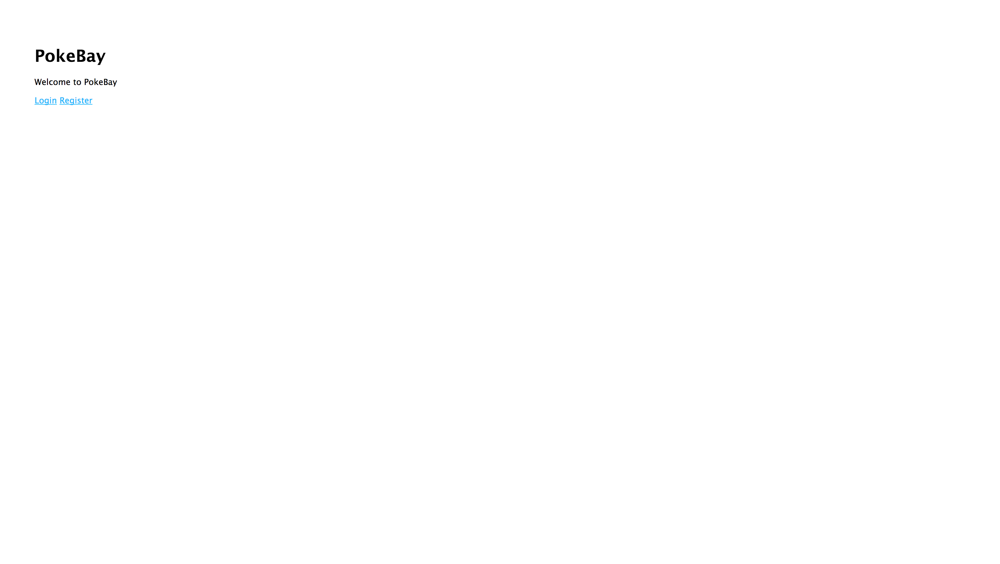

# PokeBay

Using the Schema you designed today, you will create your very own Pokemon auction site! We will use `handlebars` for the frontend (some views will be provided to you) and `pg` as our PostgreSQL client.

This is a 2-day exercise, so be sure to pace yourself appropriately. We've recommended a good stopping point between Day 1 & Day 2, but feel free to keep going and take a stab at the bonuses.

- [Day 1](#day-1)
- [Day 2](#day-2)

### Before You Begin!
In order to do this exercise you will need to have done the following:

- Created a Schema for **PokeBay** and created migrations using `db-migrate`
- Created & Populated a table for all Pokemon information

The above tasks were carried out in class preceeding this exercise. If you don't have one of the above tasks completed, make sure you get the code from a peer.

# Day 1
Let's Begin!

## Part 0: Setup
Let's create a local postgres database and launch the provided starter code!

1. Use the [`createdb`](https://www.postgresql.org/docs/9.6/static/tutorial-createdb.html) terminal command to create your very own pokebay database
    
1. Create an `env.sh` file and set the `DATABASE_URL` environment variable (don't forget to run `source env.sh` following this step)
1. Open `pool.js` and fill in the missing lines of code (found at `//YOUR CODE HERE`)
    - This file will connect to your postgres database and export the `pg` variable
1. In `app.js` import `pool.js` as the variable `db` (we will use this variable to write SQL queries). Since these queries will be written in our `routes/*` files, you should pass the `db` variable in to those files as an argument (as shown below). Modify `app.js` to include the below code, and make changes to `auth.js` & `routes.js` to account for the `db` argument.
    ```js
	app.use('/', auth(passport, db));
	app.use('/', routes(db));
	```
1. Run `npm install`
1. Run `npm start`
    - You should see **Success, you are connected to Postgres** in your terminal window
	- Navigate to `localhost:3000` and you should see the following page
	    
		
## Part 1: User Login/Registration
In this part we will set up our login and register routes. We will be working out of the `routes` folder for the following set of steps.

1. Implement a `GET /login` route which renders the provided `login.hbs` file
    - Navigating to `http://localhost:3000/login` should render a login form
1. Implement a `GET /register` route which renders the provided `register.hbs` file
    - Navigating to `http://localhost:3000/register` should render a register form
1. Before we can create `POST` routes for user authentication, let's first set up `passport` in our app
    - Navigate to `app.js` and find the `// Passport` comment. You have to implement the proceeding functions.
	- For `passport.serializeUser` you should call `done()` with `null` as the first argument and the user id as the second argument.
	- For `passport.deserializeUser` you should use `db.query` to select a user from the `users` database with a given `id`. Once the user is found call `done()` with `null` as the first argument and the result as the second argument.
	- To implement `LocalStorage` you should use `db.query` to write a query that looks for a `user` given its' `username` and `password`.
	- **Bonus:** Using [`bcrypt`](https://www.npmjs.com/package/bcrypt) hash the passwords when they're stored in your database
1. Implement a `POST /login` route that redirects to `/dashboard` on success and `/login` on failure
1. Implement a `POST /register` route that checks if username is already taken and if `req.body.password` & `req.body.password2` match. If no modifications were made to the `register.hbs` file, then your `req.body` will have the following keys:
    - `username`
	- `password`
	- `password2` (password confirmation)
	- `email`
	- `phone`
	- `street` (street address)
	- `city`
	- `state`
	- `country`
	- `postal`
1. Open `routes/routes.js` and add the following code snippet where it says `// YOUR CODE HERE`. This will redirect non-logged in clients to the `/login` route
    ```js
	router.use(function(req, res, next) {
	  if (! req.user) {
        res.redirect('/login');
	  } else {
        next();
	  }
	});
	```
1. Implement a `GET /dashboard` route that renders `dashboard.hbs` (**NOTE:** You will have to create this view)
    - This route should ONLY be visible to presently logged in users

### Goal
After successfully completing **Part 1** you should be able to:

- Create a **new** user
- Login successfully using an existing user
- Handle Login/Registration errors
- Navigate to `dashboard.hbs` proceeding a successful login
- Once users are created use [`pgweb`](https://github.com/sosedoff/pgweb) to take a look at your `USERS` table. It should contain the created users, with the appropriate attributes.

## Part 2: Profile
In this section you will create an editable user profile page.

1. Add a link to `dashboard.hbs` that points to the `/profile` route
1. Create a `GET /profile` route that renders `profile.hbs`. Using `req.user`, you should render profile information for the logged in user.
    - **Note** that, for security purposes, you do not want to send the user's password to the client
1. In `profile.hbs` allow users to view and edit their profile
    - In order to change any user info (including setting a new password), the user should be required to enter their current password
    - Create an Update button, and on click you should perform a `POST` request to `/profile` with the new user information
1. Implement a `POST /profile` route that, given updated user data, should update the users table with the new values
    - You must only update the database if the user entered a correct *current password*
1. Create a link to go back to the `/dashboard` page

### Goal
By the end of this section you should be able to:

- Navigate to the profile page from the dashboard
- Edit a user's username, password, email, phone #, street address, city, state, province, and postal code
- Navigate back to the dashboard from the profile page

## Part 3: New Auction
In this section we will walk through the steps required to create a new auction page. This page will allow users to select Pokemon, set a starting bid, set a reserve price, write a description, and set a duration. **Note** that before you begin this section you should already have a pre-populated **Pokemon** table.

1. Add a link on `dashboard.hbs` that points to the `/auction/new` route
1. Implement a `GET /auction/new` route that renders `newAuction.hbs`
1. Create a `newAuction.hbs` view that contains the following elements:
    - `pokemon_name`: users should be able to select the pokemon from a searchable dropdown ([example](https://semantic-ui.com/modules/dropdown.html))
	- `starting_bid`: the price at which the user's auction begins
	- `reserve_price`: the minimum price the user is willing to accept for the given item **(must not be lower than the `starting_bid`)**
	- `shipping`: the location where the item will be shipped from
	- `description`: a description of the item
	- `length`: the amount of time to allow bidding on this auction **(minimum 1 hour)**
1. Add two buttons to the bottom of this form:
    - `Cancel`: On click redirect to `/dashboard`
	- `Post`: On click perform a `POST` request to `/auction/new`
1. Implement a `POST /auction/new` route that inserts the above information from `req.body` into the `auction` table. Once successfully inserted redirect the user to `/auction/:id`, where `id` is the `id` of the new auction item that was just created.
1. Implement a `GET /auction/:id` route that renders `auction.hbs` for an auction with an `id` entered as a param
    - Select the auction where the `id` matches the `id` in `req.query`, and join this information with the details for the pokemon being sold (found in the `pokemon` table). The result should be joined with the `bids` table on the auction id, and then you should pass in all of the auction details to `auction.hbs`.
1. Create an `auction.hbs` view that displays an overview of the selected auction. If the auction is still ongoing users should be able to edit the auction details.
    - Users should be able to edit auction details and click an `Update` button (similar to the `profile.hbs` view)
	- There should be an `` element that renders the image from the thumbnail_url stored in the `pokemon` table
	- Users should be able to DELETE the selected auction
	- Users should be able to see the current highest bid **OR** `"No Bids"` if no bids have been placed yet
	- **If the auction has expired users should not be able to modify/delete the auction**
1. Create a link on `auction.hbs` that redirects the user back to `/dashboard`

### Goal
By the end of this section you should be able to follow the below workflow:

- Navigate to `http://localhost:3000/dashboard`and click on a **New Auction** button
- Search for and select a Pokemon from a dropdown
- Enter auction information (`starting_bid`, `reserve_price`, `shipping`, `description`, `length`)
- Click the **Cancel** button and return to `/dashboard`
- Create a new auction and click on **Post**
- View an editable overview of the recently created auction
- View a **read-only** overview of an expired auction
- Navigate to `/dashboard` from the auction overview page

# Day 2
Congratulations you're almost done creating your very own Pokemon auction site.

## Part 4: View ALL Auctions
By the end of this part we will be able to display all running auctions on `dashboard.hbs`.

1. Modify your `GET /dashboard` route to join the `bids` and `auction` tables on the auction id attribute, and then send all data (incl. Pokemon `type` and `thumbnail_link`) to `dashboard.hbs`. You should join the `auction` and `bids` tables on auction id, and then join that with the `pokemon` table on pokemon id. Then select all of the returned entries.
1. In `dashboard.hbs` create a **sortable** list of all auctions. You may want to use an external library to handle displaying and sorting the auctions (like [this one](https://datatables.net/)).
    - Display the current highest bid on all OPEN auctions, and the winning bid (also highest bid) on all CLOSED auctions
	- If no bid exists, display the `starting_bid` of the auction in its place
	- You should also display an image using the `thumbnail_url` for each auction
	- Create a **Bid** button and an `<input>` field for the `bid_amount` for all OPEN auctions not been submitted by the current user
	- **CLOSED** auctions should not have a Bid button, and should be greyed out
1. Make sure the **Bid** buttons all `POST` the `bid_amount` to `/auction/bid/:auctionId` (with each button referring to its own auction id)

## Part 5: Bid on Running Auction
This module will walk you through setting up an endpoint to handle new bid requests.

1. Implement a `POST /auction/bid/:auctionId` endpoint that takes in a `bid_amount` in the request body and a `auctionId` in the request params. This endpoint should have the following functionality:
    1. Select the max bid where the auction id matches the one in `req.params`
	1. **IF** there is no bid present, verify that the `bid_amount` in the request body is >= the `starting_bid` for this auction
	1. **IF** there is a bid present, verify that the `bid_amount` is >= the current maximum bid + $0.50 (is at least $0.50 higher than the current highest bid) **AND** that the current maximum bid was not made by the current user
	1. Insert the new bid to the bids table alone with the `auctionId` and the user id for the current user
	1. Redirect the user to the `/auction/:id` route where `id` is the `auctionId` entered in the request params

### Goal (Part 4 + Part 5)
By the end of this section you should be able to:

- Navigate to the Dashboard
- See a list of ALL running & closed auctions
- Auctions belonging to the current user & Expired Auctions will **NOT** have a Bid button
    - all other auctions should display an `<input>` field for `bid_amount` and a **Bid** button
- Bid a value >= current max bid + $0.50 on the auction
- Be redirected to the auction profile page (`/auction/:id`)
- See their bid as the max bid
- Try to bid again, but fail
- Users should see the current max bid for all open auctions
- Users should see the winning bid amount for all closed auctions
- Users should not be able to bid any amount that is less than the current max bid plus 50 cents

## Part 6: Winners
You're almost done! Try and implement the following functionality without any instructions:

- Allow users to filter auctions by OPEN and CLOSED
- Display the username of the highest bidder for CLOSED auctions

## Congrats!
You've successfully completed the PokeBay exercise! If you want to keep going and take on some more challenging tasks, below are a bunch of bonuses that you can attempt!

## Bonus
Here are some additional cool features you can add to your app!

- Use the `reserve_price` attribute from our auctions table and ONLY close an auction if the maximum bid meets the reserve price. If it doesn't quite meet the reserve price, denote the auction as `"Not Filled"`.
- Create `ratings` and `comments` tables and allow users to rate other users they've done business with
    - The ratings & comments for a user should show up on a user's profile
- Once an auction expires, notify the winner and auction owner via text (use the Twilio API)
- Create a **watchlist** on the Dashboard (a list of auctions that the user has favourited and can see at a quick glance at the top of their dashboard)
